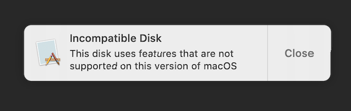
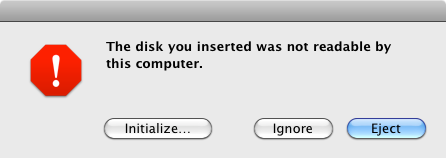

# APFSDisk
- For users with another macOS 14 or higher disk, Package to get ride of (Incompatible Disk) From Sierra to Mojave
#### The pop-up will close after 4 seconds

[Differant language of english](https://github.com/chris1111/APFSDisk/blob/main/Change-Button.md)

Install infos: Download or Clone the repos then Run ⬇︎

`Install APFSDisk.command` 

Reboot macOS to take effect.

----------------------------

For Snow Leopard and Lion ➤ [APFSDiskSnow.zip](https://github.com/user-attachments/files/18712697/APFSDiskSnow.zip) Run `Install APFSDisk.command` 

#### The pop-up will close after 3 seconds

